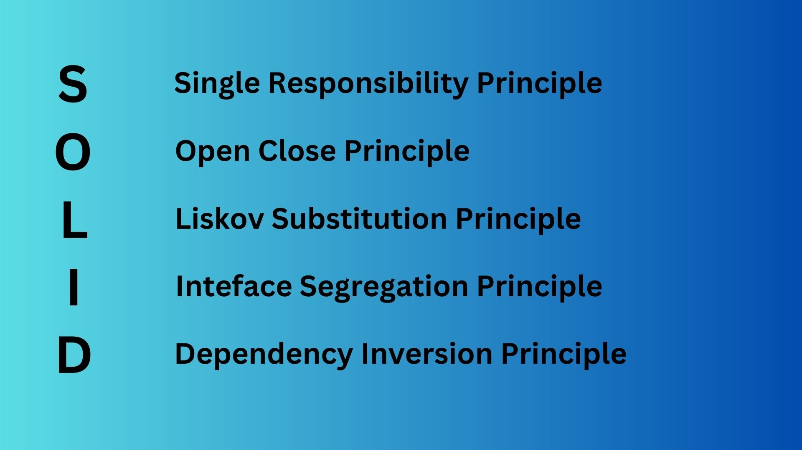

# SOLID Principal
##Introduction
SOLID principle are set of 5 principle that helps to design robust class design. Designed by famous Software scientist Robert J Martin (Uncle Bob) and the term coined
by Michel Feather ,these principles are proved rules which help in designing better software systems.
Let's look at the 5 principles 
### S - Single Responsibility principle
### O - Open Close principle
### L - Liskov Substitution principle
### I - Interface Segregation principle
### D - Dependency Injection principle



#Description

## Single Responsibility principle
As the name suggest , A class should have single responsibility to change it i.e. There should be only one reason to update 
a class. 
Consider the following class. 

```java

class Pizza{
    Pizza create(List<Ingredients> ingredients){
    //Create Pizza logic
    }
    void printInvoice(Invoice inv){
    // print any invoice for Pizza
    }
    void contactCustomer(Customer customer){
    // contact customers 
    }
}

```
 Here, Pizza class is responsible for creating a Pizza as well as printing invoice and also for contacting customer. In any
of three events we need to change the class weather we have to create a new Pizza , print any invoice or contact customers. 
This can be prone to bugs , as any functionality change will bring changes to `Pizza` class. 

Let's how can we correct it.
```java
class CreatePizza{
    Pizza create(List<Ingredient> ingredients ){
        
    }
}

class PrintInvoice{
    void printInvoice(Invoice inv){
        // print any invoice for Pizza
    }
}

class ContactCustomer{
    void contact(Customer customer){
        
    }
}
```

Now each of the class has separate responsibility and  in any of functionality change you have only to change only one class.


##  Open Close principle
##  Liskov Substitution principle
## Interface Segregation principle
##  Dependency Injection principle